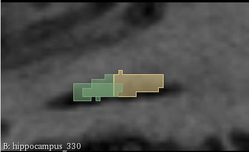
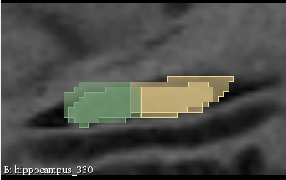
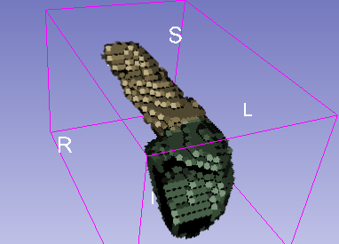
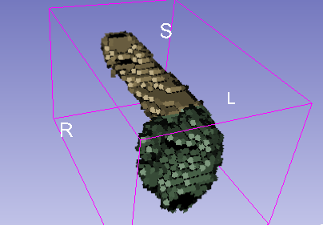
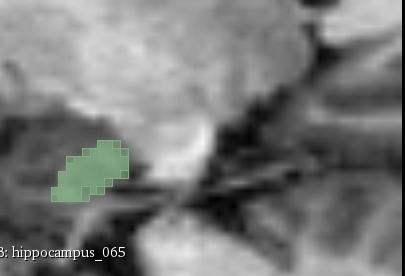

This is responding to the question "What are the best and worst performing volumes?"

The answers given here are based on analysis that can be found in `section2/out/src/inference_exploration.ipynb`

In terms of dice coefficient, the best performing volume in the training set was `hippocampus_065.nii.gz`
and the worst was `hippocampus_330.nii.gz`. A sorted list can be found in `section2/out/src/inference_exploration.ipynb`.

Why did the worst volumes perform poorly? It was hard to tell by looking at just one or two sagittal slices,
but an exploration in 3D slicer did end up explaining a little bit.

Here's a sagittal slice of `hippocampus_330.nii.gz`:

The large green and yellow regions are ground truth, and the tiny green region is the model's prediciton.
Just three sagittal slices away (so 3mm away) we have something that looks much better:

 

The model's decision about one slice cannot help it with nearby slices, since it does 2D convolutions on individual slices.
If we did 3D convolutions, we might get a little more consistency from slice to slice.

We can see the effect in the 3D volume of the predicted region:

 

Notice the hard flat edge on the right face of the predicted hippocampus.
Compare this to the ground truth from the same perspective:

 

Let's now compare to a similarly placed sagittal slice of our best-performing volume `hippocampus_065.nii.gz`:

 

Notice the brightness of the regions surrounding the hippocampus.
You can see more of this brightness difference in 
the notebook
`section2/out/src/inference_exploration.ipynb`.

It could be that images with lower contrast make our model perform more poorly.
I wonder if some contrast adjustment before inference, or perhaps as an augmentation to the training data, could improve the situation.
