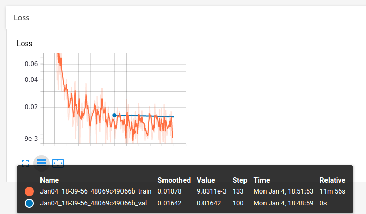
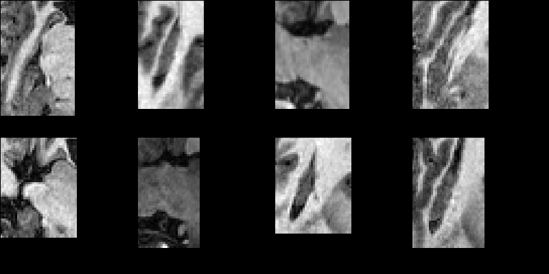
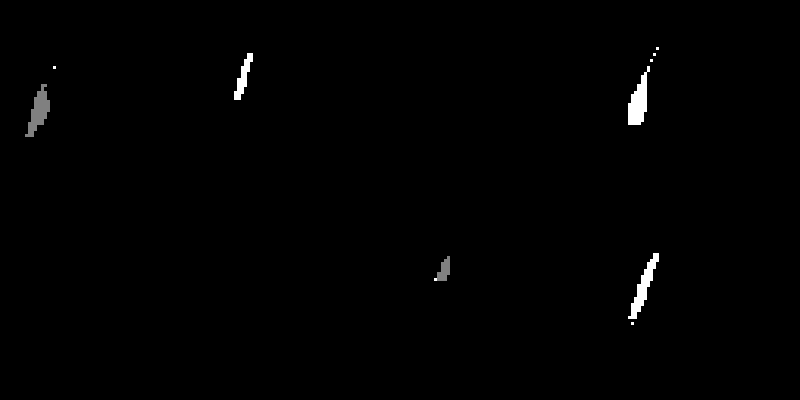
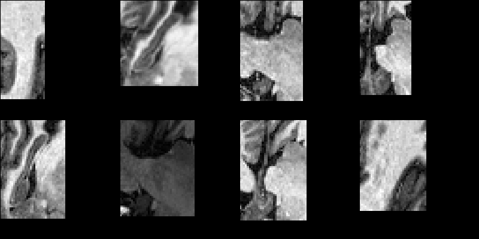
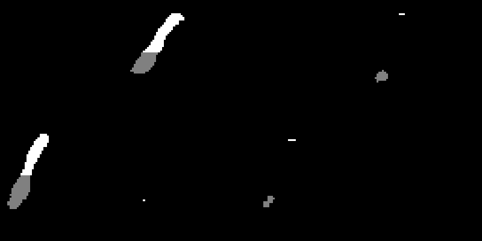
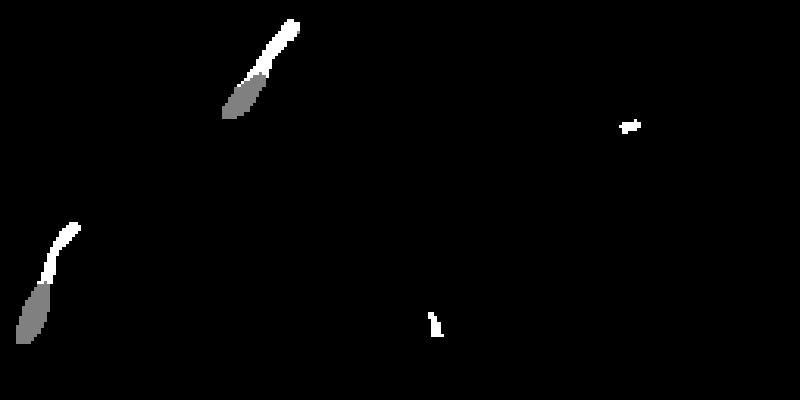
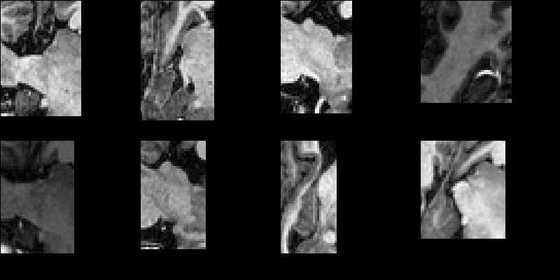
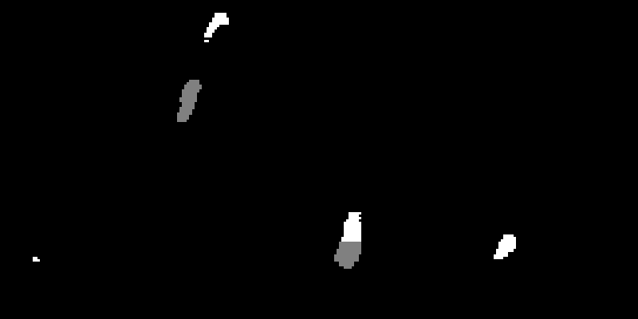
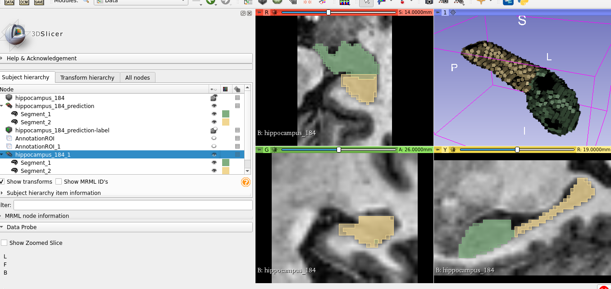

Here is 
a screenshot from tensorboard:

It shows the training loss is orange and the validation loss in blue.
The model was trained for only two epochs;
that's why there are only two validation loss points.

The following images of predictions during training were also obtained from tensorboard output:

Early stage of training (image, then ground truth, then prediction):

A middle stage of training (image, then ground truth, then prediction):

Towards the end of training (image, then ground truth, then prediction):

Here is a screenshot of slicer, while playing with an inference after the model was trained:

The 3D volume shown in the screenshot was predicted by the model.
The 2D views show both the prediction and the ground truth segmentations overlayed.
